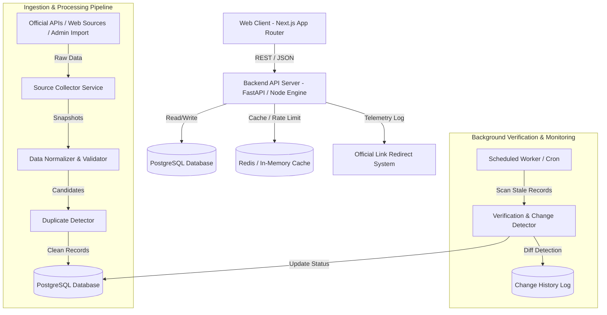

# AI Market Intelligence Hub - Architecture Documentation

## System Architecture Diagram



---

## Technical Stack Overview

### 1. Frontend Web Layer
- **Framework**: Next.js 14+ (App Router, Server Components & Dynamic Client Components)
- **Language**: TypeScript (Strict mode enabled)
- **Styling**: Vanilla CSS custom variables + Tailwind CSS for utility layout + Glassmorphism aesthetic tokens
- **Icons**: Lucide React
- **State & UI Componentry**: React Hooks, Custom Data Grids, Modal dialogs, Search Command menus

### 2. Backend Application Layer
- **Framework**: FastAPI (Python 3.11+) / REST API Server with Pydantic validation
- **ORMs & Drivers**: SQLAlchemy 2.0 (Async) + AsyncPG / Prisma Client
- **Authentication**: JWT Tokens with bcrypt hashing, HttpOnly Secure Cookies, Role-Based Access Control (RBAC: `SuperAdmin`, `Editor`, `Viewer`)

### 3. Database & Search Layer
- **Primary Relational Store**: PostgreSQL 15+ (With `pg_trgm` fuzzy text search extension and B-Tree / GIN indexing)
- **Fallback / Local SQLite Mode**: Dual-supported database interface for frictionless offline setup and testing.
- **Search Capabilities**: PostgreSQL Full-Text Search (FTS) + Trigram similarity for multi-attribute matching across 10,000+ AI product records in `< 50ms`.

### 4. Data Ingestion & Automated Monitoring Pipeline
- **Ingestion Handlers**: Modular crawlers, REST API clients (e.g. GitHub API, Open-source directories, Official Product APIs), and Bulk Import processors (CSV / JSON validation parser).
- **Change Engine**: SHA-256 field hashing and normalized field diff computation.
- **Confidence Scoring Algorithm**: Source tier weighting (Official Domain = 1.0, Official Docs = 0.9, Public API = 0.8, Directory = 0.6) combined with freshness decay.

---

## Directory Structure Strategy

```
AI MARKET HUB/
├── apps/
│   ├── web/                     # Next.js Frontend Application
│   │   ├── src/
│   │   │   ├── app/             # App Router Pages & API Proxies
│   │   │   ├── components/      # Modular UI Component Library
│   │   │   ├── lib/             # API Clients, Constants, Utilities
│   │   │   ├── types/           # Shared TypeScript Interfaces
│   │   │   └── styles/          # Global CSS & Design System Tokens
│   │   ├── public/              # Static Assets & Product Logos
│   │   └── package.json
│   │
│   └── api/                     # FastAPI / Python Backend Service
│       ├── app/
│       │   ├── api/             # REST Endpoints (Products, Models, Admin, etc.)
│       │   ├── core/            # Config, Security, DB Engine
│       │   ├── models/          # SQLAlchemy Database Models
│       │   ├── schemas/         # Pydantic Validation Schemas
│       │   ├── services/        # Business Logic & Search Services
│       │   └── ingestion/       # Ingestion & Verification Pipeline
│       ├── tests/               # Backend PyTest Suite
│       └── main.py
│
├── database/                    # Database Scripts & Seed Data
│   ├── migrations/              # Alembic / SQL Migrations
│   ├── seed_data.json           # Initial Verified Real Product Seed Data
│   └── seed.py                  # Database Seeder Engine
│
├── docs/                        # System Documentation
└── scripts/                     # Developer Setup & Build Scripts
```
